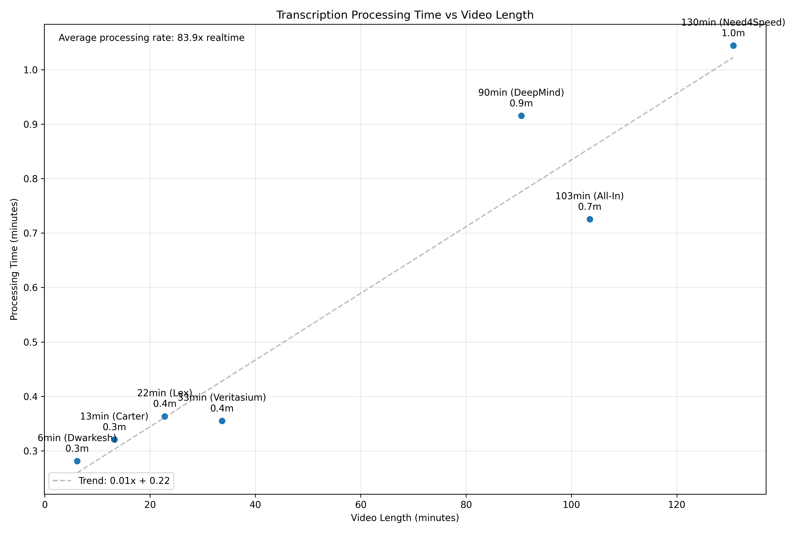

youtube transcription engine

current results:

technical overview:
flask web app that transcribes youtube videos using openai's whisper model. implements streaming pipeline architecture for downloading audio, splitting into chunks, and parallel processing.

core system:

1. download pipeline:

   - yt-dlp extracts lowest quality audio
   - ffmpeg splits into 180sec chunks
   - direct pipe between yt-dlp and ffmpeg
   - mono 16khz audio format

2. transcription pipeline:
   - whisper api processes chunks
   - 16 parallel workers
   - thread-safe queue system
   - maintains response order

api endpoints:

- /transcribe: streams transcription results
- /transcribe_benchmark: returns timing metrics

speed benchmarks:
6min video: ~12sec
13min video: ~20sec
22min video: ~30sec
33min video: ~40sec
90min video: ~95sec
103min video: ~110sec
130min video: ~140sec

dependencies:

- flask
- openai api
- yt-dlp
- ffmpeg
- python 3.11+

files:
main.py: flask app and endpoints
audio.py: audio processing pipeline
transcription.py: whisper integration
client.html: web interface
benchmark.py: performance testing

optimization history:

1. basic implementation: 64s for 16min video
2. added parallel processing: 44s
3. optimized chunk size (180s): 39s
4. increased worker threads: 36s
5. replaced pydub with ffmpeg: 30s
6. streaming pipeline: 20s

key improvements:

- direct audio streaming without temp files
- parallel chunk processing
- reduced audio quality for speed
- optimized chunk size
- efficient buffer handling

limitations:

- requires ffmpeg installation
- bound by openai api limits
- memory scales with video length

setup:

1. install dependencies
2. set OPENAI_API_KEY
3. run flask server (port 8080)
4. access via localhost:8080

usage:
paste youtube url, get transcription. processing time scales linearly with video length - see benchmark graph for estimates.

challenges ahead:

- [ ] deploy to prod
