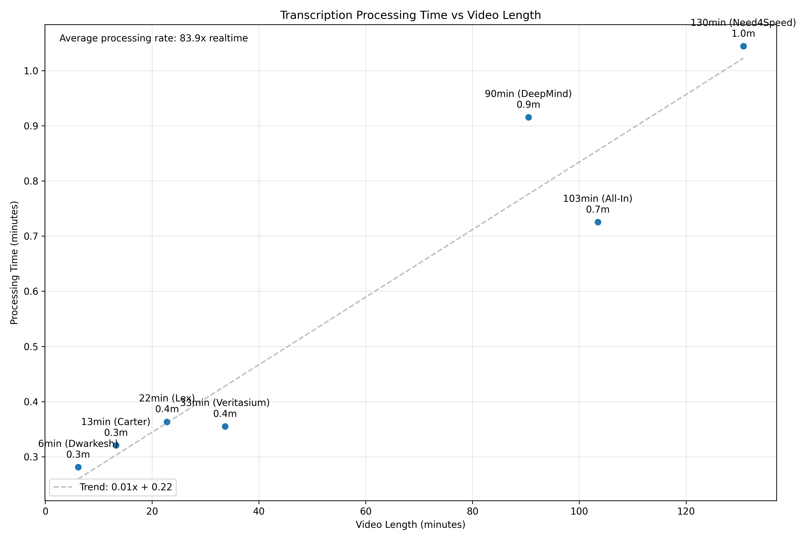

youtube transcription engine

- download video audio reliably (try various methods)
- chunk and parallelize
- call whisper backend with streaming

without concurrency, 16 minute video takes around 64 seconds.
with concurrency, 16 minute video takes around 44 seconds.
with concurrency, reduced chunk size to 6 minutes, and increased thread workers to 16 takes 39 seconds.
with added pipelined transcription workflow, still 39 seconds.
increased num. workers to 32 (increased parallelism) takes 36 seconds.

for a 31 minute video, 57 seconds
for a 1 hour video, 79 seconds

replacing pydub with ffmpeg for audio chunking gives a nice optimization:

15 minutes: 30.40508
30 minutes: 45 seconds
1 hour: 52 seconds

- [x] challenge: out of order responses because of concurrency --fix

challenges ahead:

- [x] bug: mix-up between past and current transcriptions. sometimes previous transcriptions show up in future ones.
- [x] faster! faster! faster! goal is for this to be the fastest youtube transcription engine on earth.
  - experiment with smaller chunks, more workers, making download / chunking faster, etc.
  - what worked: streaming audio pipeline with direct yt-dlp to ffmpeg processing (instead of downloading video)
    10 minute transcription takes ~20 seconds
    1 hour transcription takes ~60 seconds
- [ ] deploy to prod

current results:

